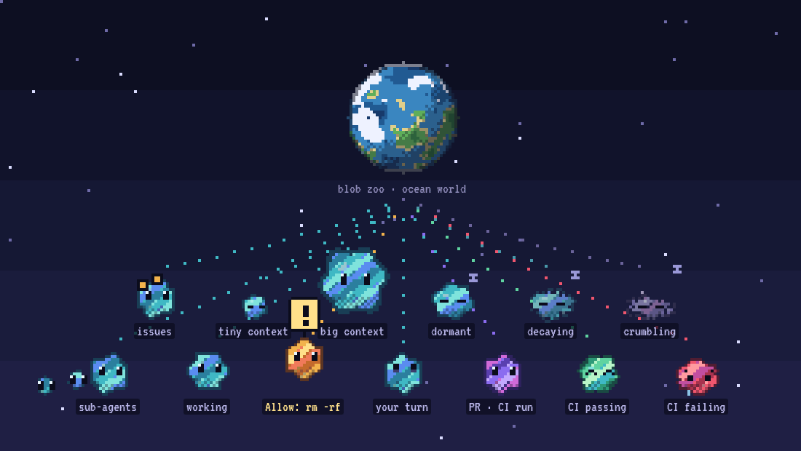
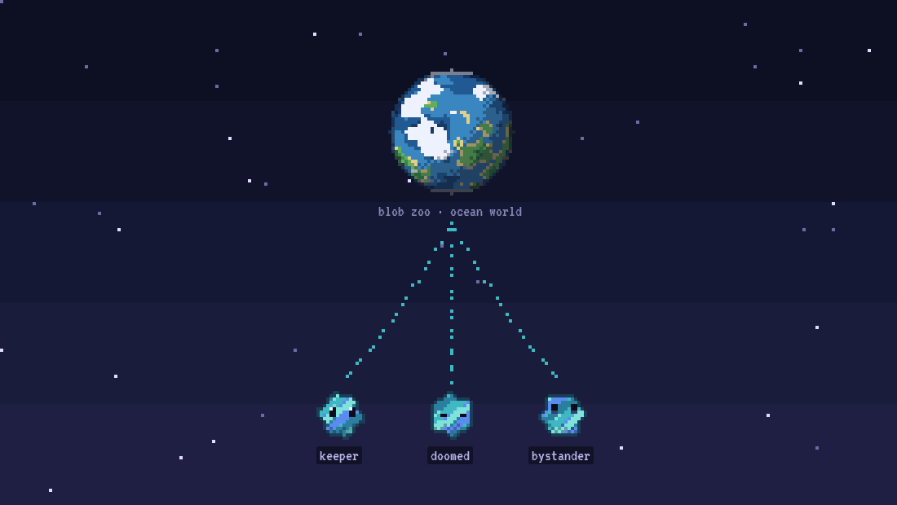
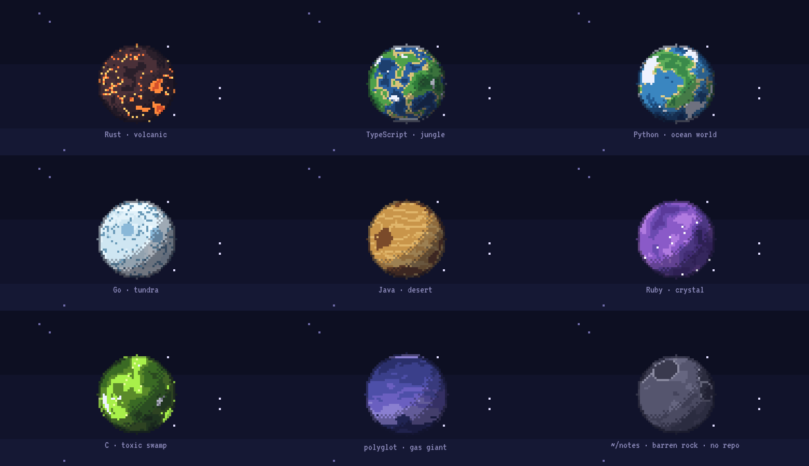

# knoware

> [!WARNING]
> **Experimental and very alpha.** Knoware is a visual side project: a way to make working with coding agents a bit more fun every once in a while, not a tool to rely on. Expect rough edges, missing pieces and things that just don't work.

A keyboard-first desktop app for running and steering coding agents, drawn as a 16-bit sci-fi world.

- **Planets** are repos (or plain directories).
- **Moons** are git worktrees.
- **Blobs** are agent sessions: they shimmer, grow with context, bounce when blocked, turn red and sad on failing CI, and slowly rot when their PR goes stale.

Agent-agnostic via the [Agent Client Protocol](https://agentclientprotocol.com) (Claude Code, Codex, and any other ACP agent). A Tauri app with a Rust backend.


## Run it

Needs Rust, Node 22+, pnpm, `git`, and (for PR/CI signals) the GitHub CLI `gh`, signed in. On Linux, also the [Tauri system packages](https://v2.tauri.app/start/prerequisites/#linux).

```sh
pnpm install
pnpm tauri dev                          # run with hot reload
pnpm tauri build                        # build the app bundle
```

Checks: `pnpm typecheck`, `pnpm test`, and `cargo test` / `cargo clippy` in `src-tauri/`.

First launch: press `a` and give a path to a repo or folder. Press `?` in the app for every key.

## Keys

| Key | Action |
|---|---|
| Arrows | Move between planets, or blobs (most urgent first) |
| `Enter` | Zoom in / open session / focus the reply box |
| `Esc` | Zoom out one level |
| `Space` | Jump to the next blocked blob, across planets |
| `y` | Allow a blocked permission request (`1`–`9` picks any option) |
| `n` | Spawn a blob where focused (planet root or the selected blob's moon) |
| `Shift+N` | New moon (worktree) + blob on it |
| `Del` | Delete blob: shocked eyes, shake, shatter. `Esc` / `u` during the shake undoes it |
| `Shift+Del` | Delete the selected blob's moon (removes the worktree; again to force a dirty one) |
| `f` | Fork the selected session into a new blob |
| `s` | Stop the current turn |
| `w` | Wake a dormant blob (loads its session) |
| `a` | Add a planet |
| `r` | Refresh PR/CI signals and look for existing sessions |

Closing the window keeps agents running. The tray icon brings it back and bounces while anything is blocked.

## Blob states

Each blob shows what its agent is doing, so you can scan a planet without opening anything.



| State | Looks like |
|---|---|
| Working | Teal; edges ripple fast and it hops gently |
| Sub-agents | Smaller blobs trailing behind it |
| Blocked | Amber, bouncing hard, with a `!` bubble and the pending command as its label. First in the `Space` queue |
| Your turn | Quiet, eyes looking up, no bounce |
| PR open, CI running | Purple |
| CI passing | Green, happy eyes, the occasional jump |
| CI failing | Red, squashed, sad eyes and a falling tear |
| Linked issues | Small amber dots on the body, one per issue key in the branch name |
| Context | Size grows with how much of the context window is used |
| Dormant | Eyes closed, nearly still, drifting z's (2 hours idle, or not running) |
| Decaying | Greys out, sags and loses pixels as the session or PR goes stale, then a fly circles it |

Deleting a blob plays shocked eyes, a building shake (the undo window), then it shatters into drifting pixel chunks:



The blob and planet captures come from `gallery.html`, a dev-only page that renders fixture scenes with a fixed clock. To regenerate them, run `pnpm dev`, then `node scripts/capture-gallery.mjs`.

## How it works

- **`src-tauri/src/agent.rs`** — the ACP client. Each blob gets its own agent subprocess (on its own thread) speaking ACP over stdio: `initialize`, `session/new` / `session/load` / `session/resume` / `session/fork`, `session/prompt`, `session/cancel`. Permission requests park until you answer. `session/list` discovers sessions you already have; they're placed on a planet by working directory and appear dormant.
- **`src-tauri/src/signals.rs`** — polls `gh pr list` per repo planet and joins PRs to blobs by branch. CI state comes from the status-check rollup. Linear-style issue keys in branch names (e.g. `eng-142`) become amber dots. Also keeps moons in sync with `git worktree list`, and runs the optional auto-cleanup of merged, clean moons.
- **`src-tauri/src/world.rs`** — planets, moons, blobs, settings. Persisted as JSON.
- **`src/render.ts`** — the pixel renderer, ported from [`prototypes/galaxy.html`](prototypes/galaxy.html).
- **`src/model.ts`** — the rules for how a blob looks: palette, mood, dormancy, decay, urgency order.

## Planets

Every planet is generated from its directory, so the same repo always becomes the same world. The app surveys each planet (`src-tauri/src/survey.rs`) for its dominant language (by tracked file extensions), file count and commit count. `src/biome.ts` turns that, plus a hash of the path, into a look:

| Dominant language | Biome |
|---|---|
| Rust | volcanic: basalt, lava seas, glowing cracks |
| TypeScript, JavaScript | jungle: continents, oceans, clouds |
| Python | ocean world: islands, heavy cloud |
| Go | tundra: ice, crevasses, polar snow |
| Java/Kotlin, C#, PHP | desert: dunes, canyons, craters |
| Ruby, Elixir, Swift, Haskell | crystal: faceted, sparkling |
| C, C++, Zig | toxic swamp: glowing acid pools |
| Shell, or no language over 35% | gas giant: turbulent bands, a storm |
| Plain folders, docs-only repos | barren rock: craters |



Unknown languages get a biome picked from the path's hash. Bigger repos are bigger planets. Repos with 1,000+ commits wear rings. Spin speed, axial tilt, terrain and clouds all come from the path's hash.

### Work on the surface

- **Construction:** uncommitted work in a planet's root checkout or a moon's worktree appears as construction on it. This is `git diff HEAD` plus untracked files, polled every few seconds. Under 40 changed lines shows cones, under 400 shows scaffolding, and more shows a crane swinging a load. Hover a planet or moon to see `+/−` lines, file counts and the biggest changed files. The session panel shows the same diff for the selected blob's checkout.
- **Pollution:** a planet root or moon with too many agents (`crowdedAt`, default 4) grows factories with smoking chimneys, a smog belt, and a brown haze over its surface. These get worse as more agents pile on.

The same planet in each state, so only the state changes. Top row: clean, small diff, medium diff. Middle row: big diff, crowded, very crowded. Bottom row: long history (rings), tiny repo, and worktree moons (one crowded with a big diff, one with a small diff).


## Settings

`settings.json` in the app's config dir (`~/.config/knoware/` on Linux, `~/Library/Application Support/knoware/` on macOS) is written with defaults on first launch:

```json
{
  "agents": {
    "claude": { "command": "npx", "args": ["-y", "@agentclientprotocol/claude-agent-acp@latest"] },
    "codex": { "command": "npx", "args": ["-y", "@agentclientprotocol/codex-acp@latest"] }
  },
  "defaultAgent": "claude",
  "dormantAfterHours": 2,
  "sessionDecayStartDays": 2,
  "sessionDecayFullDays": 14,
  "prDecayStartDays": 3,
  "prDecayFullDays": 21,
  "autoCleanupMergedMoons": false,
  "worktreeRoot": "~/.knoware/worktrees",
  "signalsPollSecs": 60,
  "diffPollSecs": 8,
  "crowdedAt": 4
}
```

Any ACP agent can be added under `agents`. [`scripts/mock-agent.mjs`](scripts/mock-agent.mjs) is a fake agent for trying the app without spending tokens: add `"mock": { "command": "node", "args": ["/path/to/scripts/mock-agent.mjs"] }` and set `"defaultAgent": "mock"`.

## To-dos

- [ ] **Run the Claude Code CLI natively.** Give each blob a real terminal session running `claude`, so you get its full interactive UI, slash commands, settings and plugins. Today Knoware drives Claude Code only through the ACP adapter. This is the biggest gap.
- [ ] Check rendering, the tray icon and the login-shell `PATH` handling on macOS. So far the app has only been run on Linux.
- [ ] A settings screen. Today settings live in `settings.json`.
- [ ] Clickable PR links, and real Linear issue data instead of keys parsed from branch names.
- [ ] Sub-agent blobs for agents other than Claude. Claude marks its sub-agent tool calls; other agents don't.
- [ ] A cheaper diff poll for very large repos.
- [ ] Pick items from [`docs/backlog.md`](docs/backlog.md): diff viewer, setup scripts for new moons, checkpoints, notifications.

## Docs

- [`docs/spec.md`](docs/spec.md) — the design spec.
- [`docs/backlog.md`](docs/backlog.md) — features to consider later (gaps vs. Conductor).
- [`prototypes/galaxy.html`](prototypes/galaxy.html) — the original visual prototype.

## License

[MIT](LICENSE)
